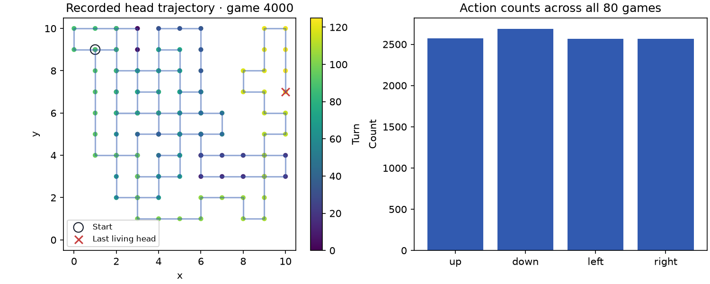
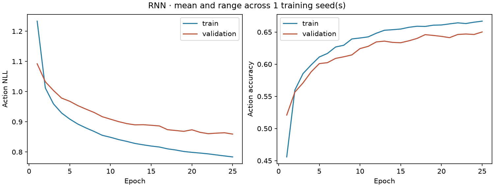
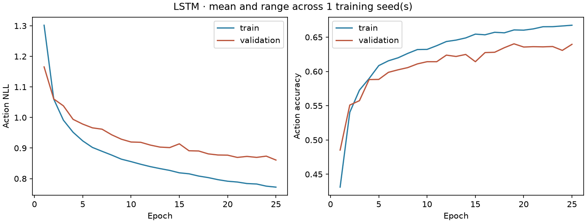
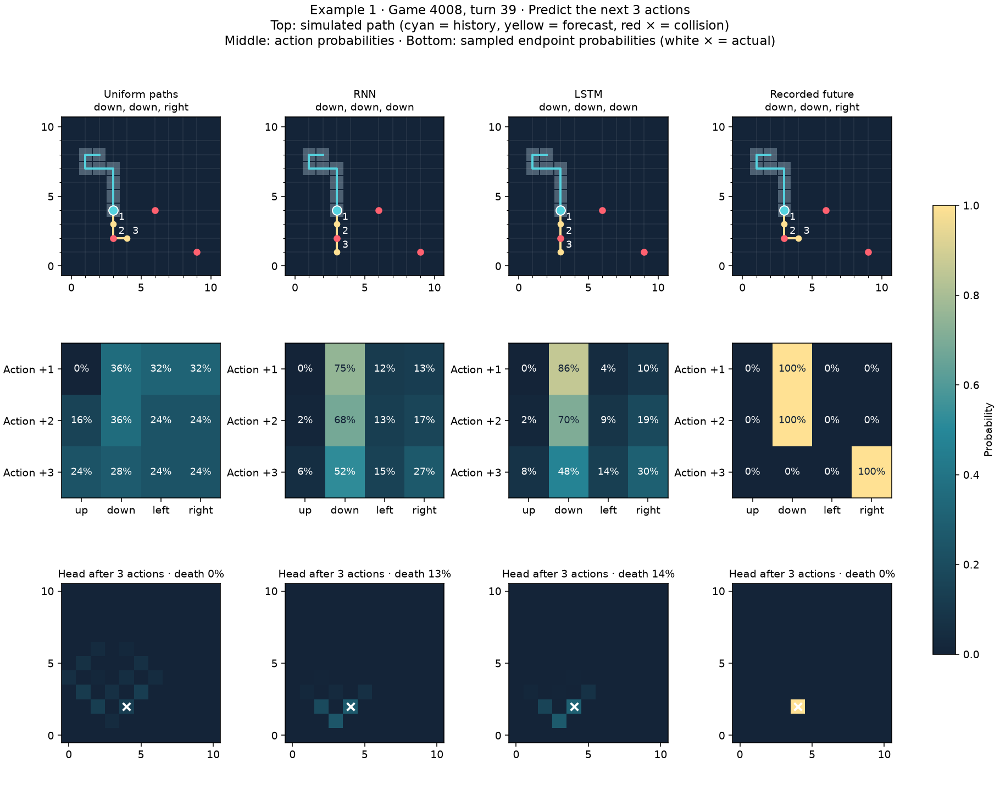
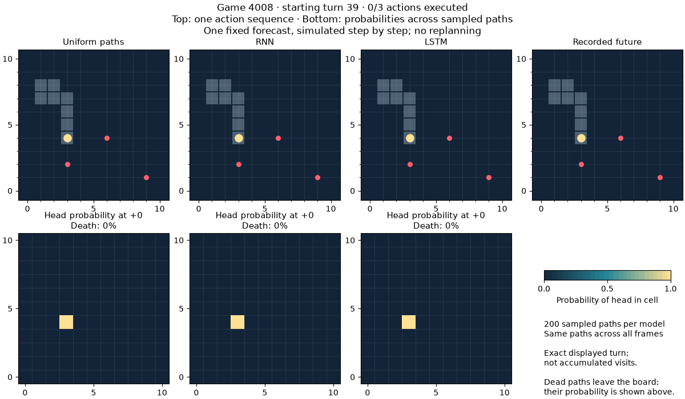
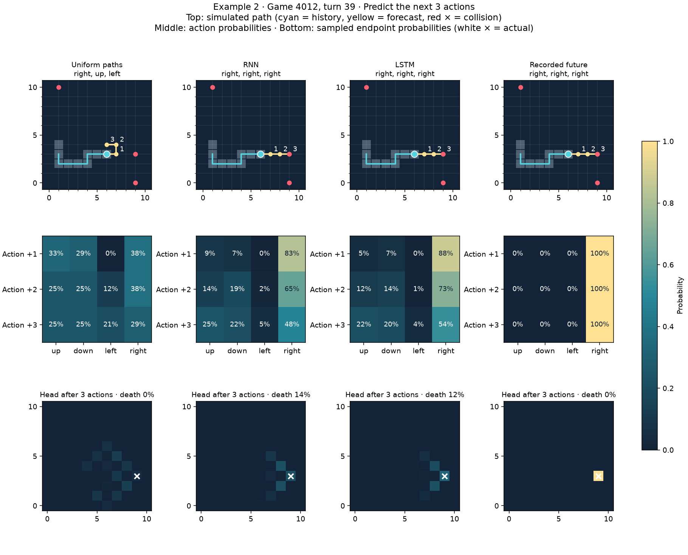
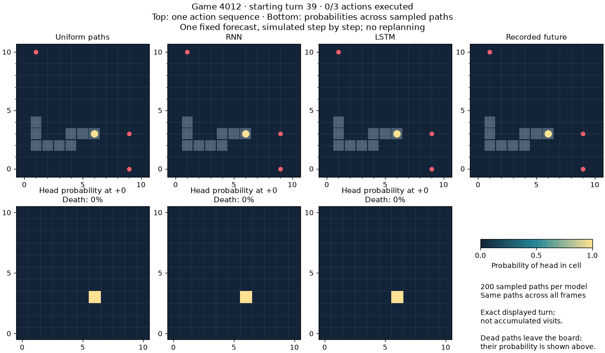
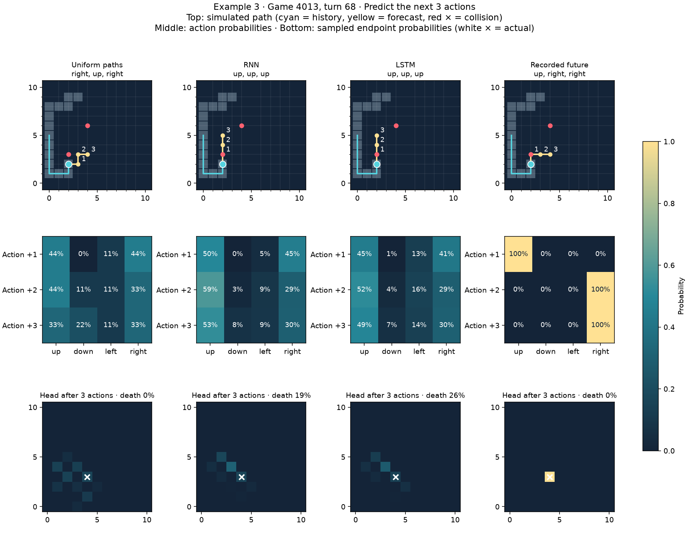
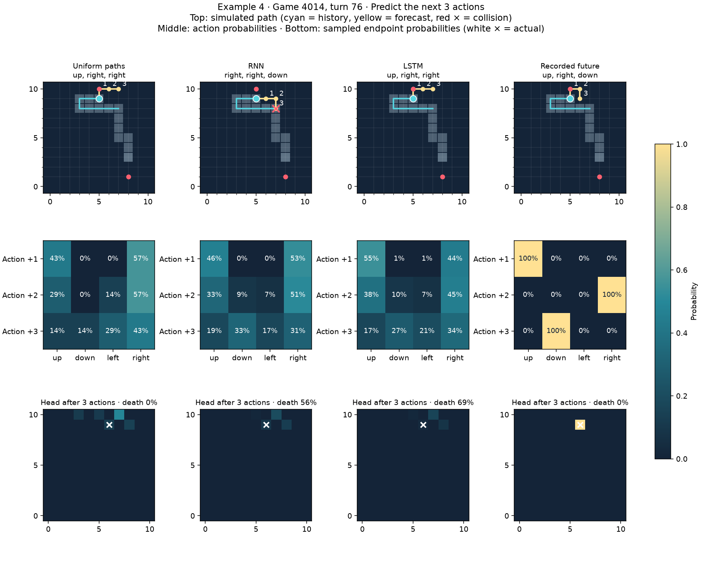
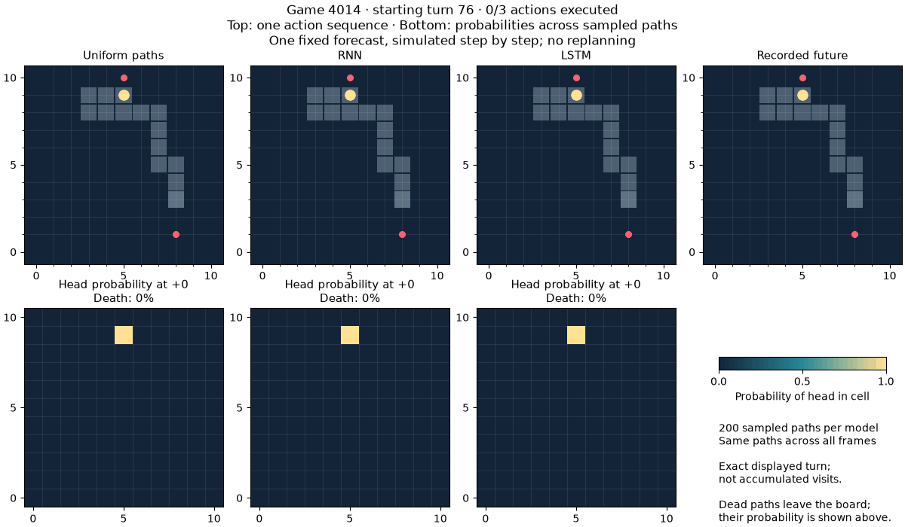

# Action prediction — completed experiment

History: 8 observations. Prediction: next 3 actions.
Inputs contain only observed state features. Targets start at the final observed turn.

## Phase results

0. Explored 80 supplied solo games (see plot below).
1. Created windows; retained only examples whose recorded future survives the whole horizon.
   - test: 12 games, 1,437 windows.
   - train: 56 games, 6,801 windows.
   - validation: 12 games, 1,354 windows.
2. Trained RNN: 5,644 parameters; seeds [0]; best validation epochs [25].
3. Trained LSTM: 20,236 parameters; seeds [0]; best validation epochs [25].
4. Evaluated on untouched test games and simulated the predicted action sequences.

| Model | Action accuracy ↑ | Exact sequence ↑ | Action NLL ↓ | Simulated survival ↑ | Correct endpoint ↑ |
|---|---:|---:|---:|---:|---:|
| LSTM | 64.4% | 29.0% | 0.839 | 87.3% | 32.9% |
| RNN | 64.5% | 29.5% | 0.838 | 86.0% | 33.8% |
| Uniform paths | 48.6% | 7.9% | 1.056 | 100.0% | 14.7% |

Metrics are averaged within each game, then over games and training seeds. Action accuracy uses each step's marginal argmax. Exact-sequence and rollout metrics use the displayed decoding rule: NN per-step argmax; one reproducibly sampled uniform complete path (every baseline path ties for highest joint probability).

The simple NN produces separate action distributions from one observed history. It does not condition later predictions on earlier predicted actions. Consequently, a predicted sequence can reverse into the body or hit a wall. Collisions are counted and shown, never repaired.

Simulation uses currently known food and does not invent future food spawns. Simulated survival is survival over the short forecast horizon, not whole-game playing strength. Recorded examples are conditioned on survival; these results do not measure prediction near death.

The source agent implementation is not provided. Neither a benefit from long memory nor LSTM superiority is guaranteed. Compare history lengths or a current-state-only model to investigate this.

## Figures

Figures use training seed 0; middle windows from the four lowest-seed test games, selected without looking at accuracy. Endpoint heatmaps come from 200 simulated samples per model and use the same 0–1 scale. Sampled death mass is shown separately; sampled heatmaps are estimates.

